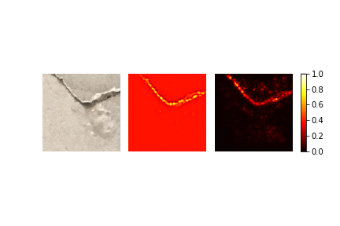

# Crack_detect

## Description

This code can be used in order to train and evaluate a neural network
(e.g. ResNet18, ResNet50) on images with binary classification. It was used on
an image data set [[1]](#1) with 40000 labeled concrete images.
In order to enhance the performance the training pipeline features data
augmentation to further increase the amount of training data and get bigger variety.
Lastly, vanilla gradient and guided backpropagation are used to get insights on
the decision process of the network.

## How to use

1. Use train.py to train the network.
2. To visualize the training process visualize_training.py can be used.
3. Bigger images can be processed in a sliding window approach via the
sliding_window.py script.
4. To obtain classification and saliency maps use use_model.py.

## Examples

The effect of the used augmentations can be seen in the following examples:

Images on the left hand side are the original images and images on the right
hand side show the image passed through the augmentation pipeline.

Using the network on bigger images with a sliding window approach leads to the
following results:

The higher the number related to the color in the overlay, the closer is that area to a crack.

In order to visualize the most important pixels for the decision process of the network two gradient-based explainability methods are implemented. The left heatmap is created by the vanilla gradient method and the right by the guided backpropagation method:

## References
<a id="1">[1]</a>
Caglar Özgenel and Arzu Sorguc (2018).
Performance Comparison of Pretrained Convolutional Neural Networks on Crack Detection in Buildings.
DOI:10.22260/ISARC2018/0094.
